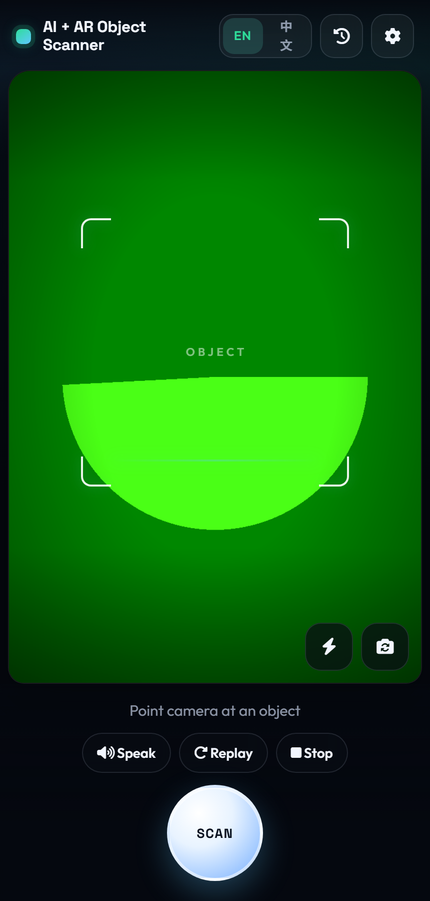
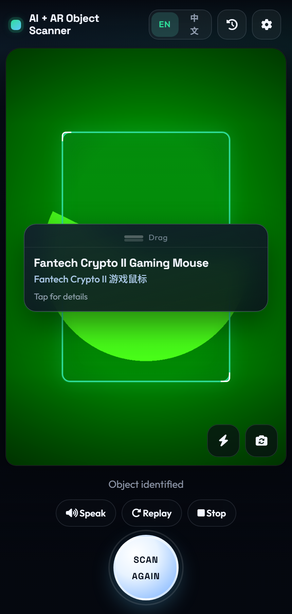
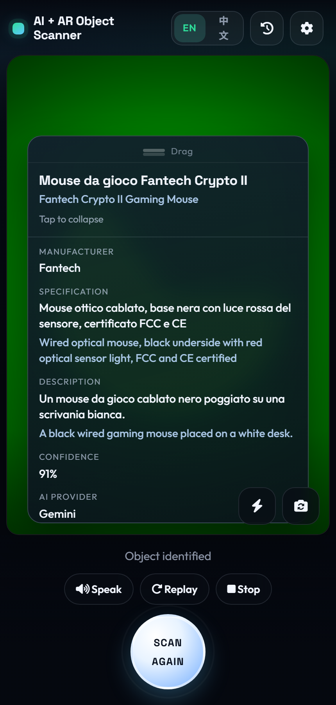
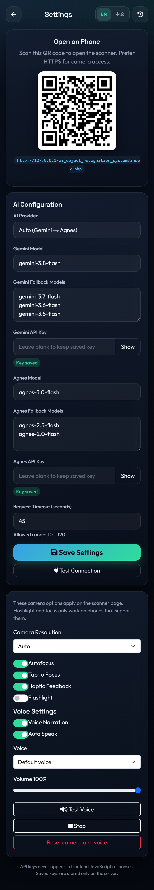
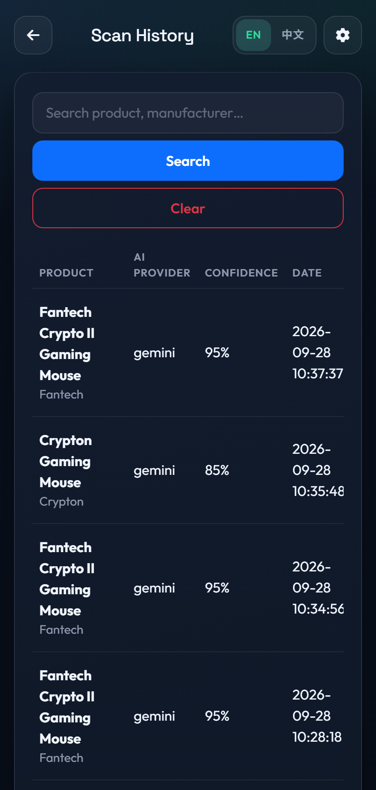
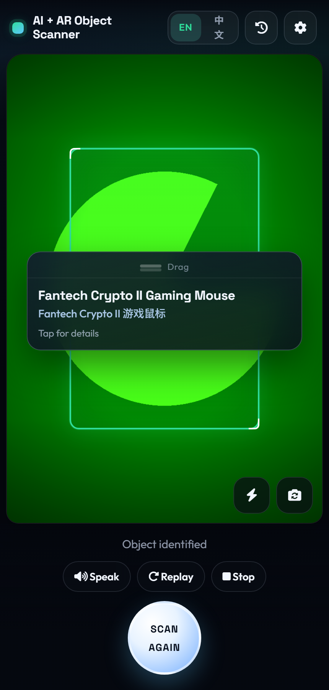

# AI + AR Object Recognition System

Mobile-first camera scanner that identifies physical objects with Gemini / Agnes Vision and shows an AR-style overlay.

## Quick start (XAMPP)

1. Put the project in `C:\xampp\htdocs\ai_object_recognition_system`
2. Copy `config/config.example.php` → `config/config.php` (empty keys are fine to start)
3. Start **Apache** in XAMPP (MySQL is optional — history uses SQLite by default)
4. Open http://localhost/ai_object_recognition_system/
5. Go to **Settings**, paste a Gemini and/or Agnes API key, choose provider, **Save**, then **Test Connection**
6. On the scanner page, allow the camera, point at an object, tap **SCAN**
7. Use **EN / 中文** in the header to switch language (saved in the browser)
8. Open **History** to browse past scans (SQLite file is created under `storage/`)

Camera tip: `http://localhost` usually works on desktop. Phones on a LAN IP over plain HTTP often block the camera — use HTTPS or a tunnel (ngrok, Cloudflare Tunnel, etc.).

## Features

- Live rear-camera preview (`getUserMedia`) + tap-to-focus when supported
- Camera tools: resolution, flashlight, switch camera, autofocus, haptic feedback
- Large **SCAN / SCAN AGAIN** control with stage-based progress (capture → AI → lookup → display)
- JPEG capture (max 1280px, quality ~0.70) via Canvas
- AI modes: **Auto** (Gemini → Agnes), **Gemini only**, **Agnes only**, with model fallbacks
- Anti-hallucination vision prompt (generic names when the model is unsure)
- Optional conservative web product enrichment
- AR overlay: bounding box + draggable, expandable, bilingual info card
- After a successful scan, the card text follows the selected voice language, and **Speak** reads product, manufacturer, specification, and description
- Site-wide **English / 中文** language switch
- Voice controls on the scanner: Speak, Replay, Stop, plus Auto Speak, volume, and voice picker in Settings
- Settings: key status (never full key), Show/Hide, Test Connection, phone QR code, camera and voice options
- Optional scan history (SQLite default or MySQL) — search, details, pagination, clear
- Secure config — API keys never appear in frontend JavaScript responses

## Screenshots

| Scanner | Scan result |
|:---:|:---:|
|  |  |

| Card details | Settings |
|:---:|:---:|
|  |  |

| History | Mobile |
|:---:|:---:|
|  |  |

## Folder structure

```text
ai_object_recognition_system/
├── index.php              Scanner (camera + AR UI)
├── settings.php           AI keys, models, QR for phone
├── history.php            Scan history
├── api/
│   ├── recognize.php      POST image → AI result
│   ├── translate.php      Translate a scan into the selected voice language
│   ├── settings.php       Save settings / test connection
│   └── history.php        List / detail / clear
├── assets/css & js        UI, camera, AR overlay, i18n
├── config/                Config example + local overrides (gitignored)
├── includes/              Vision providers, history, helpers
├── database/database.sql  Optional MySQL schema
├── docs/screenshots/      README gallery images
├── cron/                  (none — scanning is on-demand from the UI)
├── logs/                  App log (gitignored contents)
└── storage/               SQLite DB + temp files (gitignored)
```

## 1. XAMPP setup

1. Copy this folder to `C:\xampp\htdocs\ai_object_recognition_system`
2. Start **Apache**
3. Copy config:

   ```text
   config/config.example.php  →  config/config.php
   ```

4. Open: http://localhost/ai_object_recognition_system/
5. Configure keys in **Settings** (preferred) or edit `config/config.php` / `config/settings.local.php` on disk

Requirements:

- PHP 8.3+ with `curl`, `json`, `pdo_sqlite` (default), optional `pdo_mysql`, `mbstring`
- Apache with `.htaccess` support recommended
- At least one Vision API key (Gemini and/or Agnes)

## 2. cPanel / shared hosting

1. Upload into `public_html/` or a subdirectory, e.g. `public_html/ai-ar/`
2. Ensure `config/`, `logs/`, and `storage/` are writable by PHP
3. Keep `.htaccess` files (especially under `config/`, `includes/`, `logs/`, `storage/`)
4. Visit `https://your-domain.com/ai-ar/`
5. Set API keys in Settings

The app is subdirectory-safe — it does not assume install at domain root.

## 3. AI providers

| Mode | Behavior |
|------|----------|
| Auto | Try Gemini first; fall back to Agnes if needed |
| Gemini | Gemini only |
| Agnes | Agnes only |

**Gemini**

1. Create a key in [Google AI Studio](https://aistudio.google.com/)
2. Default model: `gemini-3.8-flash`
3. Fallbacks (one per line in Settings), e.g. `gemini-3.7-flash`, `gemini-3.6-flash`, `gemini-3.5-flash`

**Agnes**

1. Key from the [Agnes platform](https://platform.agnes-ai.com/)
2. Base URL: `https://apihub.agnes-ai.com/v1`
3. Default model: `agnes-3.0-flash`

Keys live in `config/config.php` and/or `config/settings.local.php` (both gitignored). The UI only shows **Key saved** / **Not configured**.

## 4. Scan history

Recognition works without a database. History is enabled by default via **SQLite**.

**SQLite (default)**

1. `db_enabled` = `true`, `db_driver` = `sqlite` in config / `settings.local.php`
2. Keep `storage/` writable — the app creates `storage/scan_history.sqlite`
3. Use `history.php` to search, open details, paginate, or clear

**MySQL (optional)**

1. Import `database/database.sql` in phpMyAdmin
2. Set in config:

   ```php
   'db_enabled' => true,
   'db_driver' => 'mysql',
   'db_host' => '127.0.0.1',
   'db_name' => 'ai_ar_scanner',
   'db_user' => 'root',
   'db_pass' => '',
   ```

Images from scans are **not** stored — only structured result metadata.

## 5. Language (EN / 中文)

Every main page has an **EN / 中文** control. Choice is stored in `localStorage` (`ai_ar_lang`) and applies to labels, status text, alerts, history UI, and the default AR card.

The scan card can also follow the **voice** chosen in Settings. English and Chinese come from the recognition result. Other languages are translated after a successful scan, then spoken in full when Auto Speak is on.

## 6. HTTPS & camera

Browsers need a secure context for the camera:

- `https://…` — required for most phones
- `http://localhost` / `http://127.0.0.1` — usually allowed for local testing

If the context is insecure, the UI shows: **Please use HTTPS to access the camera.**

## 7. Typical workflow

1. Configure API keys → **Test Connection**
2. Open scanner → allow camera → **SCAN**
3. Review AR box + expandable card (drag handle to move)
4. **SCAN AGAIN** for the next object
5. Check **History** if DB is enabled
6. Scan the Settings QR code to open the same app on a phone

## 8. Troubleshooting

| Problem | What to check |
|---------|----------------|
| Camera blocked | HTTPS / permission / another browser |
| AI provider not configured | Save a key in Settings |
| Connection test failed | Key, model name, outbound HTTPS from PHP |
| Timeout | Raise Request Timeout (10–120s) in Settings |
| History unavailable | `db_enabled`, writable `storage/`, or MySQL credentials |
| Blank page / 500 | `logs/app.log`, PHP 8.3+, `curl` enabled |
| Settings not saving | Writable `config/` folder |

## 9. Security notes

- Only commit `config/config.example.php` — never real keys
- `config/config.php` and `config/settings.local.php` are gitignored
- `config/`, `includes/`, `logs/`, and `storage/` are blocked by `.htaccess`
- Image input is validated (Base64 / MIME / size) before AI calls
- AI JSON is validated and normalized before display
- Optional `settings_pin` can lock the Settings API
- Secrets are redacted from logs

## License

This project is licensed under the [MIT License](LICENSE).